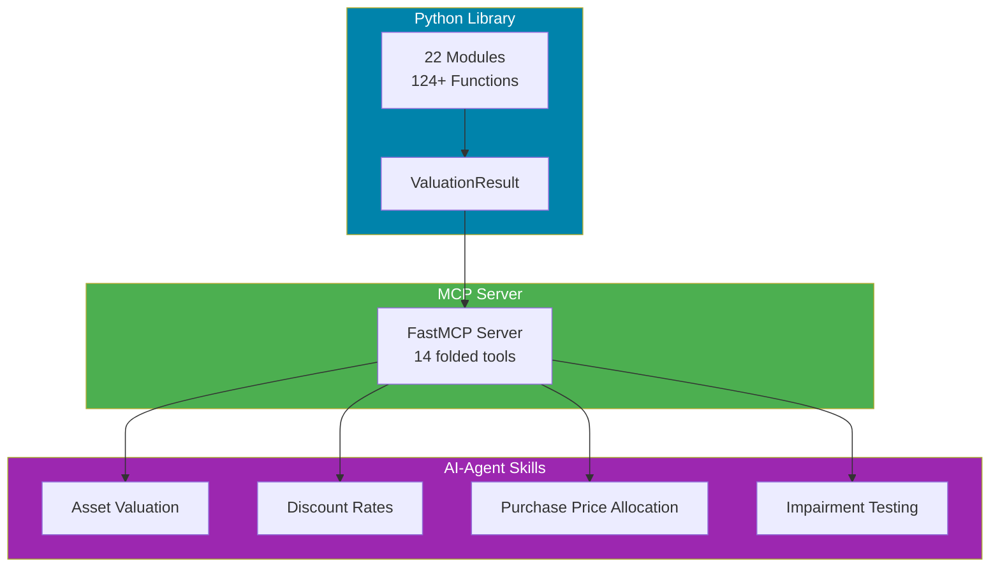

# Intangible Asset Valuation Engine

> Complete intangible asset valuation library implementing **124+ functions** from the Intangible Asset Valuation textbook. Python library + MCP server + AI-Agent Skills.

[](https://pypi.org/project/intangible-valuation/)
[](https://github.com/simonplmak-cloud/intangible-valuation/actions/workflows/ci.yml)
[](https://opensource.org/licenses/MIT)
[](https://www.python.org/downloads/)
[](https://intangible-valuation.simonmak.com)
[](https://github.com/simonplmak-cloud/intangible-valuation/actions/workflows/ci.yml)
[](https://scorecard.dev/viewer/?uri=github.com/simonplmak-cloud/intangible-valuation)
[](https://glama.ai/mcp/servers/simonplmak-cloud/intangible-valuation)
[](https://intangible-valuation.simonmak.com/api/mcp)

<!-- mcp-name: io.github.simonplmak-cloud/intangible-valuation -->

## Overview

A production-grade Python library for intangible asset valuation, implementing every formula from the **[Intangible Asset Valuation](https://www.amazon.com/Intangible-Asset-Valuation-Comprehensive-Technology/dp/B0FZ8742R1)** textbook by Simon Mak, William Yuen, Paul Wu, and Wayne Hu (Valuation in Practice Series, Ascent Partners). Designed for developers, financial analysts, accountants, and AI agents who need auditable, structured valuation computations for ASC 805 / IFRS 3 compliant workflows.

**Three-layer architecture:**



1. **Python Library** — 22 modules, 124+ typed functions, all returning `ValuationResult` (value + assumptions + steps + formula reference)
2. **MCP Server** — 14 folded tools (124+ formulas) for AI agents via stdio and hosted Streamable HTTP
3. **AI-Agent Skills** — 4 skill definitions with workflow guidance for valuation domains

## Installation

```bash
pip install intangible-valuation          # library only
pip install intangible-valuation[mcp]     # + MCP server
pip install intangible-valuation[dev]     # + pytest, ruff, mypy
```

## Quick Start

### Python Library

```python
from intangible_valuation.core.time_value import present_value
from intangible_valuation.core.discount_rates import build_up_discount_rate
from intangible_valuation.income_methods.relief_from_royalty import relief_from_royalty

# Present Value
result = present_value(future_value=500_000, discount_rate=0.10, periods=8)
print(f"PV: ${result.value:,.2f}")  # $233,253.69

# Build-Up Discount Rate
rate = build_up_discount_rate(
    risk_free_rate=0.04, equity_risk_premium=0.06,
    size_premium=0.02, industry_risk_premium=0.01, specific_risk_premium=0.03,
)
print(f"Discount rate: {rate.value:.2%}")  # 16.00%

# Relief from Royalty — Patent Valuation
value = relief_from_royalty(
    revenue_projections=[1_000_000, 1_100_000, 1_200_000, 1_300_000, 1_400_000],
    royalty_rate=0.05, discount_rate=0.12, tax_rate=0.25, useful_life=5,
)
print(f"Patent value: ${value.value:,.2f}")
```

### MCP Server (for AI Agents)

The server exposes **14 tools**, each folding a family of formulas behind a
`method` argument — time value, discount rates, cost/market/income approaches,
IP, technology, customer and human-capital assets, goodwill and purchase price
allocation, impairment, royalty analysis, uncertainty (Monte Carlo / decision
trees), and transfer-pricing / litigation.

**Local (stdio):**

```bash
pip install "intangible-valuation[mcp]"
python mcp_server/server.py
```

**Hosted (Streamable HTTP)** — no install, no API key:

```
https://intangible-valuation.simonmak.com/api/mcp
```

**OpenCode** — add to `opencode.json`:

```json
"intangible-valuation": {
  "type": "remote",
  "url": "https://intangible-valuation.simonmak.com/api/mcp",
  "timeout": 60000
}
```

**Claude Desktop / Cursor** — add the HTTP URL
`https://intangible-valuation.simonmak.com/api/mcp` as an MCP server, or run the
stdio entrypoint above.

**MCP Registry & Glama** — published as
`io.github.simonplmak-cloud/intangible-valuation`. The
[`server.json`](server.json) manifest declares both the hosted
`streamable-http` remote and a PyPI **stdio** package, and
[`glama.json`](glama.json) carries the Glama listing. Install and run the stdio
server from either registry:

```bash
pip install "intangible-valuation[mcp]" && intangible-valuation-mcp   # pip
uvx --from intangible-valuation intangible-valuation-mcp              # uvx (no install)
```

Listed on
[Glama](https://glama.ai/mcp/servers/simonplmak-cloud/intangible-valuation) and
the [Official MCP Registry](https://registry.modelcontextprotocol.io).


**Prompts and resources.** Besides the 14 tools, the server offers three guided
prompts (`purchase_price_allocation`, `value_ip_asset`, `impairment_test`) and a
machine-readable method catalog at `intangible-valuation://methods`, so agents can
see every method's required parameters before calling a tool.

### AI-Agent Skills

Copy the `skills/` directory to your agent's skills folder:

- **`asset-valuation`** — Patents, trademarks, technology, customer relationships, human capital
- **`discount-rate-construction`** — Build-up, CAPM, WACC, risk premiums, adjustments
- **`purchase-price-allocation`** — ASC 805 / IFRS 3 PPA workflow, goodwill calculation
- **`impairment-testing`** — ASC 350, IAS 36 goodwill and intangible impairment

## Valuation Methods by Category

| Category | Methods | Chapter |
|----------|---------|---------|
| **Time Value** | PV, FV, annuity, perpetuity, growing annuity, terminal value | 2 |
| **Discount Rates** | Build-up, CAPM, WACC, TAB, control premium, DLOM, currency adjustment | 2 |
| **Statistics** | Monte Carlo, decision trees, regression | 2 |
| **Cost Approach** | Reproduction cost, replacement cost | 3 |
| **Market Approach** | Comparable transactions, royalty capitalization | 3 |
| **Income Methods** | Relief from Royalty, MPEEM, incremental cash flow | 4 |
| **Intellectual Property** | Patent, trademark, copyright, trade secret | 5 |
| **Royalty Analysis** | Benchmarking, 25% rule, adjustment | 6 |
| **Technology** | Developed technology, software, data assets, platforms | 7 |
| **Customer-Related** | Customer relationships, distribution network, non-compete | 8 |
| **Human Capital** | Assembled workforce, key person | 9 |
| **Goodwill & PPA** | Goodwill calculation, PPA waterfall | 10 |
| **Impairment** | Goodwill & intangible impairment (ASC 350 / IAS 36) | 11 |
| **Monte Carlo** | Simulation, sensitivity analysis | 15 |
| **Decision Trees** | Backward induction | 16 |
| **Litigation** | Lost profits, pre-judgment interest | 17 |
| **Transfer Pricing** | CUP method, OECD guidelines | 18 |

## Why This Library?

- **Auditable** — Every function returns `ValuationResult` with value, method, formula reference, assumptions, and step-by-step calculation breakdown
- **Textbook-accurate** — All 124+ formulas verified against book example values with 1056 unit tests
- **AI-ready** — MCP server (14 folded tools) and Skills for seamless AI agent integration
- **Complete coverage** — All three valuation approaches (cost, market, income) across 19 chapters
- **Open source** — MIT license, extensible, well-documented

## Development

```bash
# Install dev dependencies
pip install -e ".[dev]"

# Run tests
pytest

# Run with coverage
pytest --cov=src --cov-report=term-missing

# Lint
ruff check .

# Type check
mypy src/

# Regenerate the MCP stdio server from the canonical surface
python scripts/generate_mcp.py
```

## Documentation

- **API Reference:** [intangible-valuation.simonmak.com](https://intangible-valuation.simonmak.com)
- **PyPI:** [pypi.org/project/intangible-valuation](https://pypi.org/project/intangible-valuation/)
- **MCP Server Guide:** [docs/mcp.md](docs/mcp.md)
- **AI Skills Guide:** [docs/skills.md](docs/skills.md)

## Companion Textbook

**[Intangible Asset Valuation: A Comprehensive Guide to Valuing Brands, IP, Technology, and Human Capital](https://www.amazon.com/Intangible-Asset-Valuation-Comprehensive-Technology/dp/B0FZ8742R1)**  
*Theory, Methods, Regulation, and Practice* — Valuation in Practice Series by Ascent Partners  
By Simon Mak, William Yuen, Paul Wu, Wayne Hu · 176 pages · 19 chapters · 3 appendices

## Citing This Project

```bibtex
@software{intangible_valuation_engine,
  author = {Mak, Simon and Yuen, William and Wu, Paul and Hu, Wayne},
  title = {Intangible Asset Valuation Engine},
  year = {2026},
  url = {https://github.com/simonplmak-cloud/intangible-valuation},
  license = {MIT},
}
```

Based on formulas from the **Intangible Asset Valuation** textbook.

## Use with Context7

Up-to-date Intangible Asset Valuation Engine documentation is indexed on [Context7](https://context7.com/simonplmak-cloud/intangible-valuation), so coding agents can pull it into context on demand. With the Context7 MCP server or `ctx7` CLI installed, name the library in your prompt:

```text
use library /simonplmak-cloud/intangible-valuation for API and docs
```

## License

MIT — see [LICENSE](LICENSE) for details.
